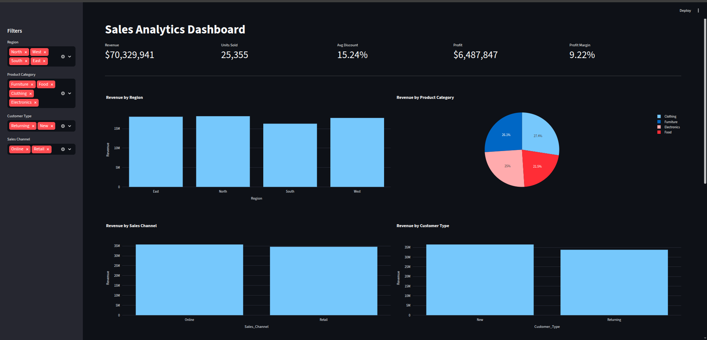
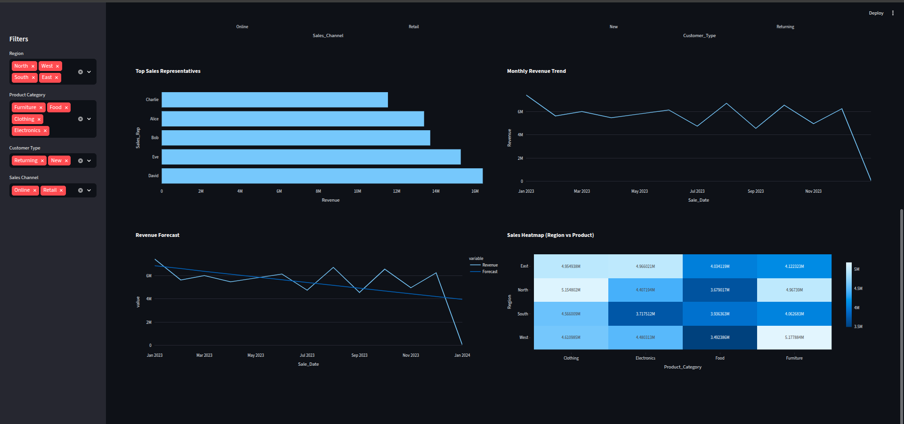

# 📊 Sales Analytics Dashboard

Interactive **Business Intelligence dashboard** built with Python to analyze sales performance across regions, products, and customer segments.

The dashboard provides key business metrics, trend analysis, and interactive filtering to explore sales insights.

---

# 🚀 Project Overview

This project demonstrates how Python can be used to build a **data analytics dashboard** similar to BI tools like Power BI or Tableau.

The dashboard analyzes sales data and provides insights into:

* revenue performance
* product category trends
* customer segmentation
* sales channels
* top performing sales representatives
* profit and profit margin
* revenue forecasting

Users can dynamically filter the dashboard by region, product category, customer type, and sales channel.

---

# 📊 Dashboard Preview

### Overview



### Advanced Analytics



---

## 🌐 Live Dashboard

[Open Interactive Dashboard](https://sales-analytics-dashboard-sk.streamlit.app/)

---

# 📈 Dashboard Features

## Key Performance Indicators (KPI)

The dashboard calculates key business metrics:

* Total Revenue
* Units Sold
* Average Discount
* Total Profit
* Profit Margin

---

## Sales Analysis

The dashboard includes several analytical views:

* Revenue by Region
* Revenue by Product Category
* Revenue by Sales Channel
* Revenue by Customer Type
* Top Sales Representatives

---

## Advanced Analytics

Additional analytical views include:

* Monthly Revenue Trend
* Revenue Forecast
* Sales Heatmap (Region vs Product Category)

These visualizations help identify patterns and trends in sales performance.

---

# 🛠 Technologies Used

The dashboard was built using the following technologies:

* Python
* Pandas
* Plotly
* Streamlit
* NumPy

---

# 📂 Dataset

The dataset used in this project was sourced from **Kaggle**.

It contains simulated sales transaction data including:

* Sale Date
* Region
* Product Category
* Sales Representative
* Sales Amount
* Quantity Sold
* Unit Price
* Unit Cost
* Customer Type
* Discount
* Sales Channel
* Payment Method

Dataset source: Kaggle.

---

# ▶️ How to Run the Dashboard

### 1 Install dependencies

```bash
pip install streamlit pandas plotly numpy openpyxl
```

### 2 Run the dashboard

```bash
streamlit run sales_dashboard.py
```

### 3 Open in your browser

```
http://localhost:8501
```

---

# 📁 Project Structure

```
Sales-Analytics-Dashboard
│
├── sales_dashboard.py
├── sales_data.xlsx
├── requirements.txt
├── README.md
│
└── images
    ├── dashboard1.png
    └── dashboard2.png
```

---

# 🎯 Project Purpose

This project demonstrates practical skills in:

* data analysis
* data visualization
* business intelligence dashboards
* interactive analytics applications

It is designed as a **portfolio project for Data Analyst / Business Analyst roles**.


GitHub
https://github.com/KuzevaStasy
